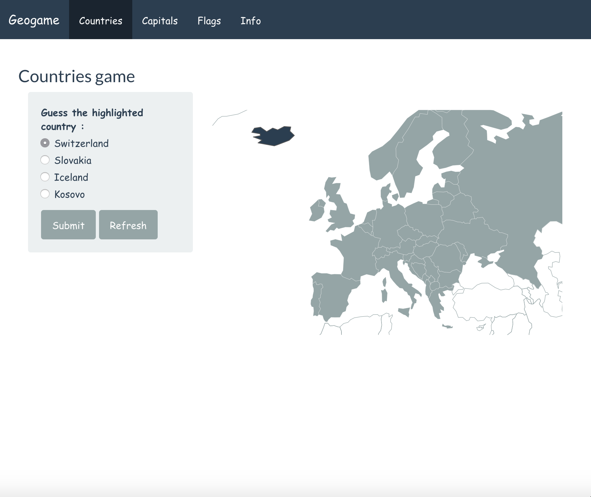

# GeoGame

## Overview

Welcome to my readme file for the capstone project ! This project is a Shiny app made with the golem framework with modules for scalability. My app tabs are structured as follows : 

- Countries : Game app for guessing countries that highlight on a map
- Capitals : Game app for guessing capitals of countries that highlight on a map
- Flags : Game app for guessing flags
- Info : Tab that display info on selected countries

To play the game, click [here](https://jasonola.shinyapps.io/geogame-full)

Here is a screen shot of the Countries tab : 

## Data

- [Natural earth](https://www.naturalearthdata.com/downloads/)

The naturalearth dataset is a dataset of countries with various data and a geometry variable to plot the countries as a map. The important data are the country names, iso (for joins) and geometries.

- [Capitals](https://simplemaps.com/data/world-cities) 

Dataset to use with natural earth to join capitals. In the capitals dataset we have for capitals of countries with which country it is from, the name of the city, its coordinates, its ISO, and what kind of capital it is (if it's and administrative or secondary capital...)

- [Flags](https://www.kaggle.com/zhongtr0n/country-flag-urls/version/1)

Finally in the flags dataset we have data by country and ISO for flags images that are located on an associated URL. Here is an example flag URL : https://www.worldometers.info//img/flags/small/tn_af-flag.gif 

## How to navigate different files ? :

The code used to build the logic of the app is located in the R folder and the CSS file is in the inst/www folder. Package description is located in the DESCRIPTION file and the data are in the data and worlddata folders.

## Run the app

Open the .rproj file in RStudio and run `devtools::load_all()` then `run_app` in the R console. 
