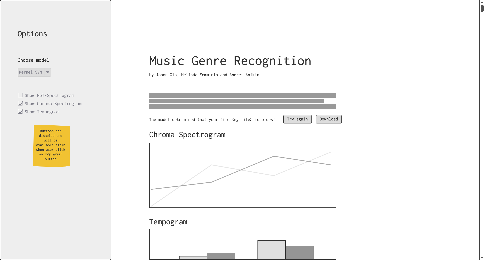
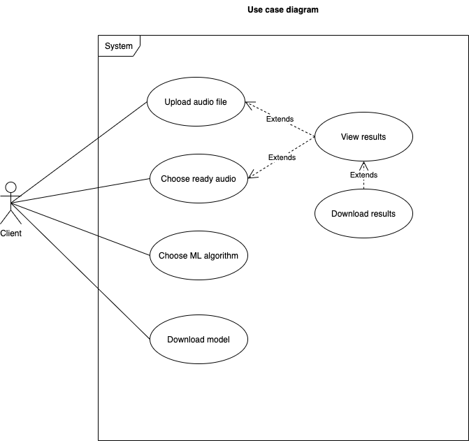

# Music Genre Recognition

Music Genre Regonition is developed by Jason Ola, Andrei Anikin and Melinda Femminis during the semester of spring 2021 for the course _"Développement logiciel"_ given by Davide Picca at the University of Lausanne.

Jump to:
- [The project](#the-project)
- [How to try it?](#how-to-try-it?)
- [Competition analysis](#competition-analysis)
- [Features](#features)
- [Technical specifications](#technical-specifications)
    - [I. Choosing](#I.-choosing-the-programming-technologies)
    - [II. Extracting features](#II.-extracting-features-from-audio-files)
    - [III. Choice of algorithms](#III.-choosing-our-machine-learning-algorithms)
    - [IV. Model training](#IV.-training-our-models)
    - [V. Saving the models](#V.-save-the-model)
    - [IV. Interface](#VI.-interface)
- [Wireframes](#wireframes)
- [Diagrams](#diagrams)
- [Gantt Chart](#gantt-chart)

## The project

The project aims to recognize an audio file's musical style with machine learning algorithms. 
It will be accessibl through a browser where the user will be able to upload a .mp3 or .wav audio file that will then be preprocessed and analysed by our app. The result will then be displayed for the user to see, as well as some diagrams created from the input if the user chooses so. 
We want to have different models and all will be trained on the [GTZAN dataset](http://marsyas.info/downloads/datasets.html). This dataset consists of 100 30 seconds .wav files that are already classified in 10 musical genres. It also contains features that are already extracted from those audios.
The accuracy of each model is yet to be determined.

## How to try it? 

To test our project with your own tracks, follow the next steps: 
1. Download the repository
2. Open the terminal and navigate to the `flask` directory: `cd users/yourusername/flask`
    - *optional: activate a virtual environement*
3. Run `pip install -r requirements` to install dependencies
4. Run `flask run` and follow the link to open Music Genre Recognition in your brower locally

## Competition analysis

Among our competitors there are Shazam, SoundHound, MusixMatch, Music ID, Genius. Also, all of these music detection apps have more broad list of services to offer.

- Shazam offers such services as identification of music by microphone and suggestion of playlists based on user’s preferences. In addition to songs recognition, Shazam identifies their album, label, date of release and genre. Yet, the app shows top 200 the most popular songs in your region (country, city).
- SoundHound has similar features to Shazam except for that it provides way less information about the song. Yet, there is a genre classification within the app but the genre of input song is not displayed. 
- MusixMatch has not so many features as Shazam or SoundHound. It provides only the name and artist of the song. However compared to other apps, they have a unique feature allowing their users to translate lyrics to multiple languages and read them while the song is playing. 
- MusicID uses Gracenote metadata which allows them to identify genre and mood of the song extremely accurate. Also, they allow users to leave comments on each song which are visible only for themselves. 
- Genius is more silimilar to MusixMatch in the sense that it allows users to read lyrics likewise in karaoke, highlight lines of text and read annotations. 

In addition, all of our competitors are present on iOS and Android markets. However none of them has online web application for music recognition. We are deploying our project as web application using Flask. Hence, it could be accessible from any operating system that supports modern browsers. 
Our main competitive advantage is the machine learning algorithm which allows to achive high quality results without excessive coding. Also, our other competitive advantage can be simple, user friendly design. As we don’t have plenty of features, we will not have overwhelmed interface with extra icons, menus, etc. Other possible advantages are options of displaying the accuracy of guessing the genre, choosing the AI model.

## Features
**Basic feature**
- From wav or mp3 input, identify the genre of the song and return it to the user

**Advanced features**
- Let the user choose the model use to identify the song
- Display the mel spectrogram, tempogram and chroma spectrogram is the user choose to do so
- Have an option for the user to download the result

## Technical specifications

This section is about the different tools and libraries that we will use to implement the features presented above.

### I. Choosing the programming technologies

- Python: main language
- pyAudioAnalysis: Feature extraction
- Scikit-learn: tools for machine learning
- Flask: Interface
- Matplotlib/Seaborn: general visualizations
- Yellowbrick: machine learning specific visualizations

### II. Extracting features from audio files

Our audio files are in wav format, it is impossible to use this format as is to train our algorithms. We need to have data in the form of matrices or tables. This is where the pyAudioAnalysis library comes in, it will be useful to extract the features and then add them to an array.

### III. Choosing our machine learning algorithms

For this work we will use the Scikit-learn library. The work consists of classifying audio files, so we have to use classification algorithms. Our data is numerical and 1000 lines long. We will choose 4 algorithms keeping these filters in mind:
- Logistic regression 
- K-Nearest Neighbors
- Random forest 
- Kernel SVM

### IV. Training our models

First, we need to standardize the variables so that we have data without size influence. Next, we need to separate our data into training and test data. We will choose respectively 800 and 200 data. Be careful to stratify the labels during the separation to have an equal distribution of each label. The validation will be done in the cross-validation with some grid searches where we can optimize the hyperparameters in order to have the best version of the model.
When the model is trained, we test it on our 200 data. We will evaluate the efficiency of the models with a confusion matrix and a classification report.

### V. Save the model

This is where we will use pickle to store our machine learning model for future use.

### VI. Interface

Use Flask to create a user interface like the final wireframe. Build an interface around our the created model that evaluates the audios transmitted by the user.

## Wireframes

**Wireframes v1.0** \
In this first version, the only feature is to take an audio file and detect it's musical genre. It is a simple single page layout with centered content and no menu.

**Wireframes v2.1 with additionnal features** \
In this version, the user can choose the model used as well as to display some visual representations of the audio file or not. Those options are accessible in a permanent side bar.

The v2.1 is available for testing online! 
Follow this link to test the project in your browser: [Live test the wireframes](https://balsamiq.cloud/stmtnsn/pj540h2/rBC5D?f=N4IgUiBcAMA0IDkpxAYWfAMlAjPAQhiALK7wBaRA0lANoC6AvkA%3D)

## Diagrams

### Activity diagram 
  
This diagram shows how the user and the system will interact.  
The user also has optional actions like choosing a specific model or download the result.

### Use case diagram
  

## Gantt chart

